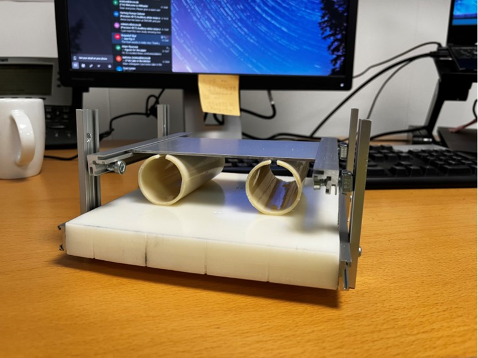
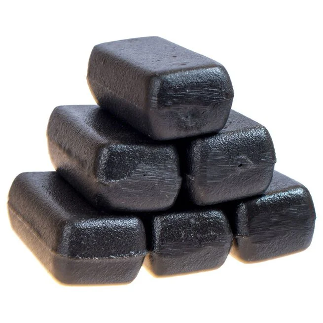
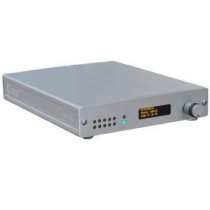
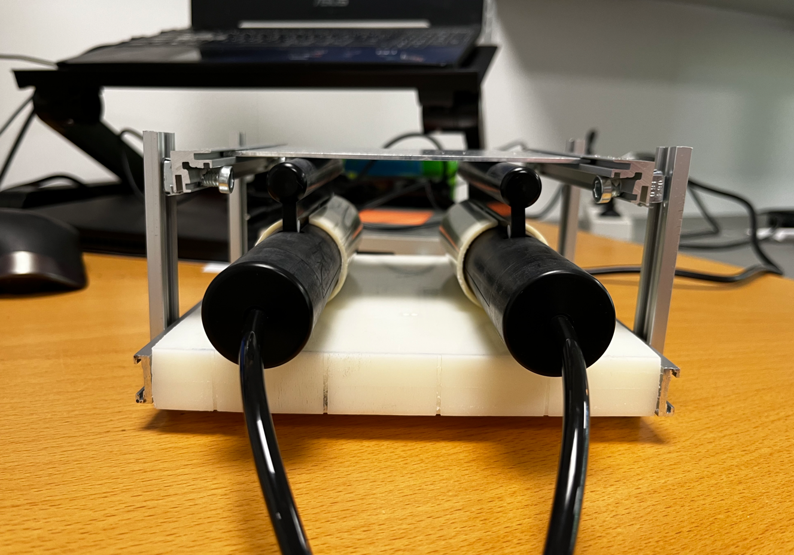

# CURDES devices calibration
Scripts that help to QA CURDES devices used in Precision-BCT/ADAPT-PD projects. 
## Scripts and subfolders
* [CALIBRATION_DUAL.py](https://git.drcmr.dk/vytautasl/curdes-calibration/-/blob/main/CALIBRATION_DUAL.py) - main script for bimanual device calibration. Both devices are used at the same time.
* [CALIBRATIONv3.py](https://git.drcmr.dk/vytautasl/curdes-calibration/-/blob/main/CALIBRATIONv3.py) - an older script used to calibrated same bimanual devices one by one. The set up was quite unstable and frictious, therefore discontinued.
* [newton.py](https://git.drcmr.dk/vytautasl/curdes-calibration/-/blob/main/CALIBRATIONv3.py) - script to convert Newton values back to arbitrary values (used in the follow up experiments with an external max force measuring device)
* [average.py](https://git.drcmr.dk/vytautasl/curdes-calibration/-/blob/main/average.py) - the script that outputs average values and averaged weight/device output relationship plots. Current script looks for 'BEH','MRI' and 'EEG' substrings in CALIBRATION_DUAL outputed calibration logs. If you named your folders other than that, you need to change the strings inside the script - a list 'average'.

```
* All at once (default) *
average = ['MRI','EEG','BEH']

* If separate *
average = ['BEH']
average = ['MRI']
average = ['EEG']

Or something else...
average = ['...']
```

* [log](https://git.drcmr.dk/vytautasl/curdes-calibration/-/tree/main/log) - output destination for calibration scripts. Every run is saved with your pre-defined name (important for average.py) and current date. Some of the outputs were moved to [UseTheForce](https://git.drcmr.dk/vytautasl/behavioral-data-analysis-toolbox) toolbox to help convert the arbitrary device outputs to Newtons. 
* [Average](https://git.drcmr.dk/vytautasl/curdes-calibration/-/tree/main/log/Average) - output destination for averaged values inside log folder.

## How to use
Some calibration measures come with the toolbox, but in case you want to QA your devices or do additional measures you will need some sort of optimal calibration set up (an example of the set up used in Precision-BCT and ADAPT-PD studies is provided below) and CURDES grip force devices (in current example bimanual will be used)



And you will need some heavy weights. We used these below, from [bodystore.dk](https://www.bodystore.dk/weighted-blocks-to-b.c-weight-vest-10-kilo/68-5059924.html). Each weight is 1.1 kg.



### Calibration process (bimanual devices)

* Plug in the 932 interface unit to the computer and to the devices.



* Insert the devices into the set up sockets, make sure they are approximately in the middle. 
* You need to calibrate the devices with the 932 unit:
  - Press the knob and select 'Mode select'
  - Select 603 mode and press the handle again. Don't touch the devices while performing this action. (We used 603 mode but calibrate with whatever mode you use for your experiment).
  - You might want to repeat the process a couple of times.



* Open up your code editor (VScode for example) and start CALIBRATION_DUAL.py. If this is the first time you are using the code, it is best if you start your own virtual environment, and install the required packages.
You can clone the scripts using
```
git clone https://github.com/your-username/your-repo.git
cd your-repo
```
After you set up the environment, install all required packages from the requirements.txt file
```
pip install -r requirements.txt
```

* As the window opens, add the name for the procedure. Name it something sensible. We named it either 'MRI','EEG' or 'BEH' (capitalization is not relevant). Most important thing - at least some part of this name has to be the consistant! This way the average.py script will know which folders have to be pooled for averaging.


* Full screen window will open next


#### Main window navigation


* On the left side you can see the force output for the left device, on the right - for the right (unless you switched the devices places).

* In the middle - soon to be filled calibration plot. On x axis you have weight in kg, y axis - device output.

* On top of the plot - folder name where the results will be stored (it contains the name you entered in previous step and the current date.

* Below the figure there are some inputs you can provide to the script:

  - **ENTER** - register baseline. The devices should be calibrated with 932 interface unit and with no weight on them, besides the metal plate on top.

  - **ESC** - quite the session.

#### Calibrating

* Press ENTER to proceed with current baselines.

* The window will change slightly:

  - **ENTER** - register current output. You should press it with every weight step. Default weight step is 1.1 kg (placing two weights at the same time).

  - **ESC** - quite the session (data is not saved)

  - **SPACE** - quite the session and save the data

  - **M** - plot 'MRI' folders data from previous trials alongside the current measures. It will not affect the calibration output, only the figure if you choose to save it. 

  - **E** -  plot 'EEG' folders data from previous trials alongside the current measures. It will not affect the calibration output, only the figure if you choose to save it.

  - **B** - plot 'BEH' folders data from previous trials alongside the current measures. It will not affect the calibration output, only the figure if you choose to save it.


* Press the first pair of weights (double than the defined step), wait for the output to stabilize and press ENTER to register. Keep repeating this step until you want to save the output.

### Averaging the output

**Current set up relies on you that each calibration is the same length**

Simply run average.py to get averaged output plots. They will be saved in log/Averages folder. Make sure your 'average' list is defined for you, looking for specific substrings.